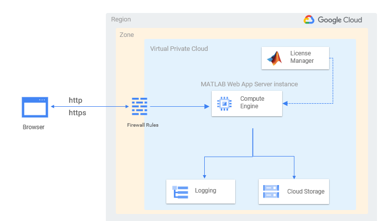

## Setting up *MATLAB Web App Server&reg; on Google Cloud Platform&trade; using Terraform&reg;*

The following guide will help you automate the process of running [MATLAB Web App Server](https://www.mathworks.com/products/matlab-web-app-server.html) on the [Google Cloud Platform](https://cloud.google.com/gcp)™ (GCP). The automation is accomplished using [Terraform](https://www.terraform.io/)™ scripts and is supported for Linux environments only.

### Requirements:

* MathWorks:
  * MATLAB Web App Server&reg; release R2020a or later
  * [MATLAB&reg; License Manager on Google Cloud Platform](https://github.com/mathworks-ref-arch/license-manager-for-matlab-on-gcp-using-terraform.git)
* Google Cloud Platform:
  * Access to Google Cloud&trade; service account credentials
  * Access to Google Cloud&trade; project
  * Enabled Google Cloud Platform APIs
    * [Google Compute Engine&trade;](https://cloud.google.com/compute)
    * [Google Cloud Storage&trade;](https://cloud.google.com/storage)
    * [Google Cloud Logging&trade;](https://cloud.google.com/logging)
  * Install Google Cloud SDK to access [gcloud&trade;](https://cloud.google.com/sdk/gcloud) and [gsutil&trade;](https://cloud.google.com/storage/docs/gsutil) APIs.
  * SSH keys for authenticating [gcloud&trade;](https://cloud.google.com/sdk/gcloud) and [gsutil&trade;](https://cloud.google.com/storage/docs/gsutil) communication.: 
    * Learn how to [create SSH keys](https://cloud.google.com/compute/docs/instances/adding-removing-ssh-keys#createsshkeys).
    * Learn how to [locate an existing SSH key](https://cloud.google.com/compute/docs/instances/adding-removing-ssh-keys#locatesshkeys).
* Terraform ([v1.0](https://www.terraform.io/upgrade-guides/1-0.html)) : Documentation for [Installing Terraform](https://learn.hashicorp.com/tutorials/terraform/install-cli)
* Linux : Install the following Linux packages on your system/VM: [unzip](https://packages.ubuntu.com/search?keywords=unzip), [wget](https://packages.ubuntu.com/search?suite=default&section=all&arch=any&keywords=wget&searchon=names), [curl](https://packages.ubuntu.com/search?suite=default&section=all&arch=any&keywords=curl&searchon=names), [jq](https://packages.ubuntu.com/search?suite=default&section=all&arch=any&keywords=jq&searchon=names).


### Getting Started :

The following steps can help in getting started:

1. Clone this repository as follows:
```
>> git clone https://github.com/mathworks-ref-arch/matlab-web-app-server-on-gcp-using-terraform.git
```

2. Make sure you have an existing Network License Manager setup on Google Cloud as well. See instructions on setting up a Network License Manager on Google Cloud [here](https://github.com/mathworks-ref-arch/license-manager-for-matlab-on-gcp-using-terraform.git).

3. Install [Google Cloud SDK](https://cloud.google.com/sdk/docs/install). This step will ensure you are able to run `gcloud` and `gsutil` commands from the system provisioning Google Cloud resources. Perform gcloud authentication using command `gcloud auth login`. This will authorize the gcloud API to access the Cloud Platform with your Google user credentials.

4. [Install Terraform](https://www.terraform.io/upgrade-guides/1-0.html) v1.0 on Linux.

5. Terraform configuration uses some startup scripts for initialization of VMs. To authenticate Terraform requires `metadata-based SSH key configurations`. **Create a set of SSH keys** if one does not exist. See this [link](https://cloud.google.com/compute/docs/instances/adding-removing-ssh-keys#createsshkeys) for steps. Provide the location of this key within `variables.tf` for both Build and Deploy stage as follows.
```
# Path to ssh key for gcloud login and authorization
variable "gce_ssh_key_file_path" {
  type = string
  description = "/home/local-gce-user/.ssh/google_compute_engine.pub"
  default = "/home/matlabuser/.ssh/google_compute_engine.pub"
}
```

5. Configure the default values for variables within `Software/variables.tf` . For more details see [Software/Readme.md](Software/README.md).

6. Run `terraform init` and `terraform validate` to make sure your current configuration based on default values set in `variables.tf` is intialized and valid. 

7. This repository includes an [example script](Software/example.sh), which can used to standup a sample MATLAB Web App Server cluster on Google Cloud, provided all dependencies have been installed and authentication related steps have been followed.
**Note:** The values used for the subset of variables initialized within the `example.sh` script will override the values for the variables set within `variables.tf`.
   

### Authentication:

In order to make requests against any required Google Cloud Platform API, the user needs to authenticate himself/herself. The preferred method of provisioning resources with Terraform is to use a Google Cloud [service account](https://cloud.google.com/iam/docs/service-accounts), that can be granted a limited set of IAM permissions scoped out by the platform administrator.

In order to access a set of credentials, a user can visit the [service account key page in the Cloud Console](https://console.cloud.google.com/projectselector2/iam-admin/serviceaccounts?supportedpurview=project) and choose an accessible Google cloud project to list the existing service accounts. One can either choose an existing service account, or create a new one based on permissions. [See steps for creating a service account](https://cloud.google.com/docs/authentication/production#create_service_account). Once a service account is ready for use, the user needs to download the JSON key file from the selected service account on the local machine/VM being used for provisioning. The next step is to define an environment variable `GOOGLE_APPLICATION_CREDENTIALS` to provide application level access to the credentials. [See instructions for setting the environment variable](https://cloud.google.com/docs/authentication/production#passing_variable). 

Also, provide the location of the credentials within `variables.tf` as shown below.

```
# Path to service account credentials 
variable "credentials_file_path"{
  type = string
  default = "credentials.json"
  description = "Provide full path to the credentials file for your service account"
}
```
[For more details, see Terraform documentation on support for adding credentials](https://registry.terraform.io/providers/hashicorp/google/latest/docs/guides/getting_started#adding-credentials).

### Resources created by this Reference Architecture:

* Google Compute instance to host the web app server.
* VPC network (Optional):
   * Firewall rules allowing INGRESS for MATLAB Web App Server ports over `http`,`https` and `ssh`.
   * Target tags to apply Firewall rules for the selected Google Compute instance.

### Architecture for MATLAB Web App Server setup on Google Cloud using the reference architecture :



### Quick Links:

* [Configure MATLAB Web App Server Licensing](https://www.mathworks.com/support/requirements/matlab-web-app-server.html).
* [Google Cloud authentication using Service Accounts](https://cloud.google.com/docs/authentication/production)
* [About MATLAB Web App Server](https://www.mathworks.com/products/matlab-web-app-server.html)
* [MATLAB Runtime Installers](https://www.mathworks.com/products/compiler/matlab-runtime.html)

### License
The license for this reference architecture is available in the [LICENSE.MD](LICENSE.MD) file in this repository. This package uses certain third-party content which is licensed under separate [license agreements](Mozilla_Public_License.txt).

### Enhancement Requests
Provide suggestions for additional features or capabilities using the following link:
https://www.mathworks.com/products/reference-architectures/request-new-reference-architectures.html

### Support
Email: mwlab@mathworks.com

[//]: #  (Copyright 2022 The MathWorks, Inc.)
